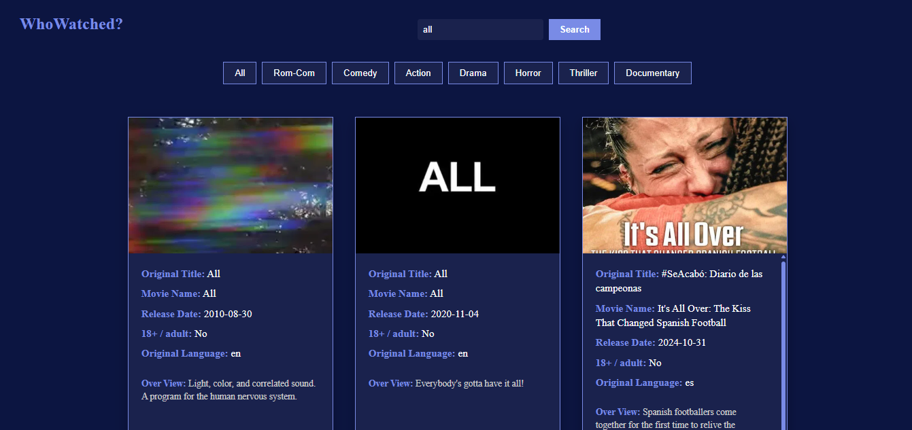

# Movie Search App in React - WhoWatched?

A movie search application built with **React** that allows users to search for movies, browse by categories, and view detailed information including posters, language, release date, and more. It fetches movie data using **The Movie Database (TMDB) API**.

[Live Demo](https://namrata725.github.io/movieSearchAppInReact/)

---

## Preview



---

## Features

- Search movies by name using TMDB API
- Filter movies by category (Rom-Com, Comedy, Action, etc.)
- View movie poster and details like:
- Original title
- Language
- Release date
- 18+/adult rating
- Overview
- Responsive UI
- Loader/spinner while fetching data

---

## Tech Stack

- **Frontend**: React (with hooks), HTML, CSS
- **API**: [The Movie Database (TMDB)](https://www.themoviedb.org/documentation/api)
- **Deployment**: GitHub Pages

---

## Folder Structure

```
movieSearchAppInReact/
├── public/
├── src/
│   ├── css/
│   │   ├── card.css
│   │   └── Header.css
│   ├── Card.js
│   ├── CategoryBtn.js
│   ├── Header.js
│   ├── MovieApp.js
│   └── index.js
├── package.json
└── README.md
```

---

## Installation & Usage

### 1. Clone the Repository

```bash
git clone https://github.com/namrata725/movieSearchAppInReact.git
cd movieSearchAppInReact
```

### 2. Install Dependencies

```bash
npm install
```

### 3. Add TMDB API Key

Replace your API key inside `MovieApp.js`:

```js
const API_KEY = "your_tmdb_api_key";
```

You can get your API key from [TMDB](https://www.themoviedb.org/documentation/api).

### 4. Run the App

```bash
npm start
```

Open [http://localhost:3000](http://localhost:3000) in your browser.

---

## Deployment

This app is deployed using **GitHub Pages**. To deploy:

```bash
npm run build
npm run deploy
```

Make sure your `package.json` includes:

```json
"homepage": "https://yourusername.github.io/movieSearchAppInReact"
```

---

## Learnings

- React functional components and hooks (`useState`, `useEffect`)
- Conditional rendering
- Working with third-party APIs
- Structuring reusable components
- Fetching and handling async data
- Deploying React apps on GitHub Pages

---

## Thank you for visiting my GitHub profile.
